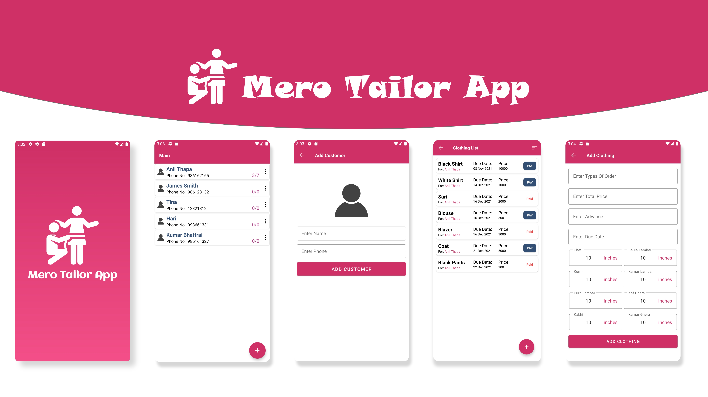

# Mero Tailor App
This is an app made for a Tailor/ Clothing shop where the owner can add all the clothing orders and keep track of all the order and what clothes are paid/ unpaid.We also have a notification system to keep track of all the urgent orders that are due soon.

 All the data are stored in local Sqlite Db so the user doesn't have to login to any account.

***Download latest apk from below 👇***

## Built With 🛠
- [Kotlin](https://kotlinlang.org/) - First class and official programming language for Android development.
- [Navigation Component](https://developer.android.com/guide/navigation) -Navigation refers to the interactions that allow users to navigate across, into, and back out from the different pieces of content within your app.
- [View Binding](https://developer.android.com/topic/libraries/view-binding) View binding is a feature that allows you to more easily write code that interacts with views. 
- [Room](https://developer.android.com/jetpack/androidx/releases/room?gclid=Cj0KCQiA5OuNBhCRARIsACgaiqUnb-12SiTOCIWzXCsEN6B6jHgRxg6KVmkypDErWL23e-sicbM6L38aAlf_EALw_wcB&gclsrc=aw.ds)The Room persistence library provides an abstraction layer over SQLite to allow for more robust database access while harnessing the full power of SQLite.
- [Retrofit](https://square.github.io/retrofit/): A type-safe HTTP client for Android and Java.
